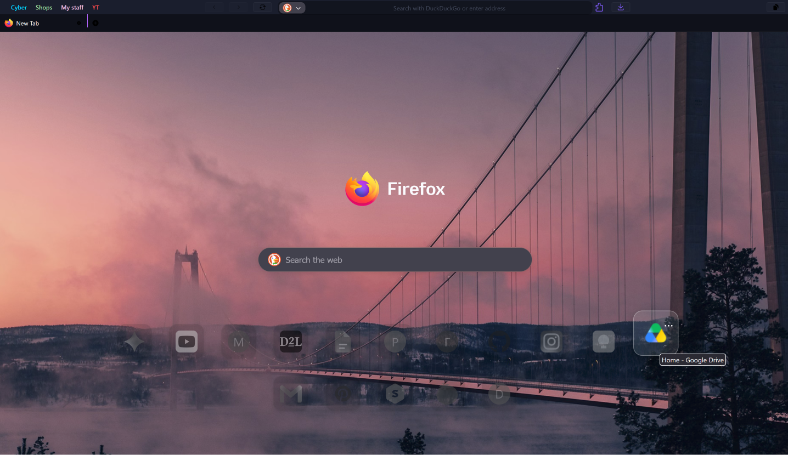

# Dark Minimalist Theme for Mozilla Firefox

A `userChrome.css` and `userContent.css` theme for Mozilla Firefox focused on minimalism, dark blue and dark purpule colours. 
It modifies the browser's interface to reduce visual clutter and implements custom SVG icons.

## Features

* **Compact User Interface**: Hides redundant buttons, titles, and visual elements from the main toolbar and bookmarks bar to maximize screen space.
* **Custom Color Palette**: Utilizes a dark background scheme with high-contrast purple accents and distinct, categorized colors for bookmark folders.
* **Modified New Tab Page (`about:home` / `about:newtab`)**: 
  * Implements a centered layout with the search bar repositioned to the top.
  * Hides text labels beneath top sites for an icon-only interface.
* **Custom SVG Assets**: Replaces default navigation and tab control icons with integrated custom vector graphics.
* **Active Tab Indicators**: Applies a gradient underline border and distinct typography to identify the currently active tab.

## Installation Instructions

1. Navigate to `about:config` in the Firefox address bar and accept the risk warning.
2. Search for the `toolkit.legacyUserProfileCustomizations.stylesheets` preference and double-click to set its value to `true`.
3. Navigate to `about:support` in the address bar.
4. Locate the **Profile Folder** row and click the **Open Folder** button.
5. Create a new directory named `chrome` within the profile folder.
6. Clone or download this repository and extract all files (`userChrome.css`, `userContent.css`, and all `.svg` files) directly into the `chrome` directory.
7. Restart Firefox to apply the theme.

## Repository Structure

* `userChrome.css` — Modifies the browser chrome (tabs, URL bar, navigation buttons, bookmarks).
* `userContent.css` — Modifies internal web content pages (specifically configuring the layout and animations for `about:home` and `about:newtab`).
* `*.svg` files — Custom vector icons required by the stylesheet for toolbar buttons.
